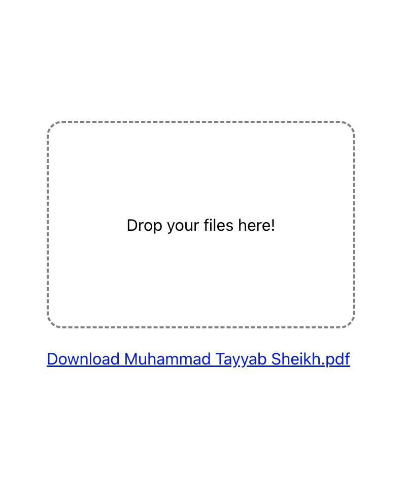
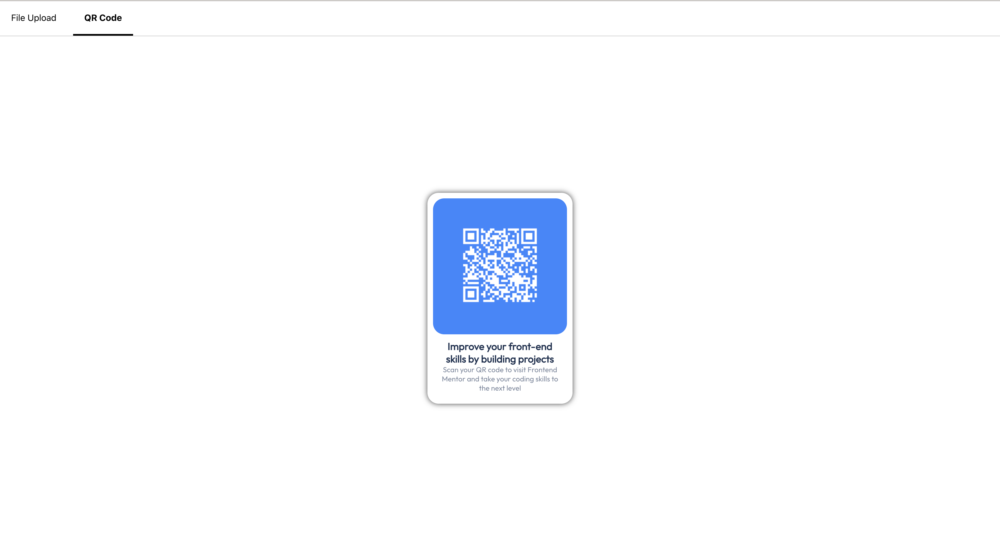

# React Playground: My Personal Sandbox for Diving Deep into React
> Author: [**@cstayyab**](https://github.com/cstayyab)

## Table of Contents
- [React Playground](#react-playground)
  - [Usage](#usage)
  - [Components](#components)
    - [File Upload](#file-upload)
    - [QR Code Generator](#qr-code-generator)
    - [Tabs](#tabs)


## Usage
1. Clone the repository
```bash
git clone https://github.com/cstayyab/react-playground
```
2. Install dependencies
```bash
npm install
```
3. Run the project
```bash
npm start
```
4. Open in browser and navigate to any component via [tab bar](#tabs) at the top

## Components
Here's the list of components that are available in this project with thier respective documentation.
### File Upload
Creates a File Drag and Drop component and stores it in IndexedDB as downloadable file



```jsx
// src/App.js

import React from 'react';
import styles from './App.css';
import FileUpload from './components/FileUpload';


function App() {
  return (
    <div style={{
      display: 'flex',
      flexDirection: 'column',
      alignItems: 'center',
      justifyContent: 'center',
      height: '100vh'
    }}>
      <FileUpload />
    </div>
  );
}

export default App;

```

### QR Code Generator
Generates a QR Code for the given text and display it as a Card with its title and description. This component was created as a solution to problem given on [Frontend Mentor](https://www.frontendmentor.io/challenges/qr-code-component-iux_sIO_H/hub).


```jsx
// src/App.js

import React from 'react';
import QrCode from './components/QrCode';


function App() {
  return (
    <div style={{
      display: 'flex',
      flexDirection: 'column',
      alignItems: 'center',
      justifyContent: 'center',
      height: '100vh'
    }}>
      <QrCode value="https://www.frontendmentor.io/" title="Improve your front-end skills by building projects" description="Scan your QR code to visit Frontend Mentor and take your coding skills to the next level"/>
    </div>
  );
}

export default App;
```

### Tabs
Tabs are used to navigate between different components so you can preview all the available components easily. They are defined in `src/components/ReactTabs.js` and can be used as follows:



```jsx
// src/App.js

import React from 'react';
import FileUpload from './components/FileUpload';
import QrCode from './components/QrCode';
import Tabs from './components/ReactTabs';


function App() {
  return (
    <Tabs tabs={[
      {
        title: 'File Upload',
        component: <FileUpload />
      },
      {
        title: 'QR Code',
        component: <QrCode value="https://www.frontendmentor.io/" title="Improve your front-end skills by building projects" description="Scan your QR code to visit Frontend Mentor and take your coding skills to the next level" />
      }
    ]} active={0}/>
  );
}

export default App;
```


